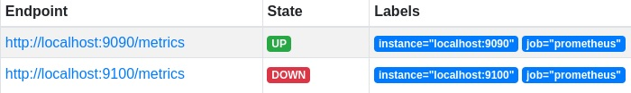
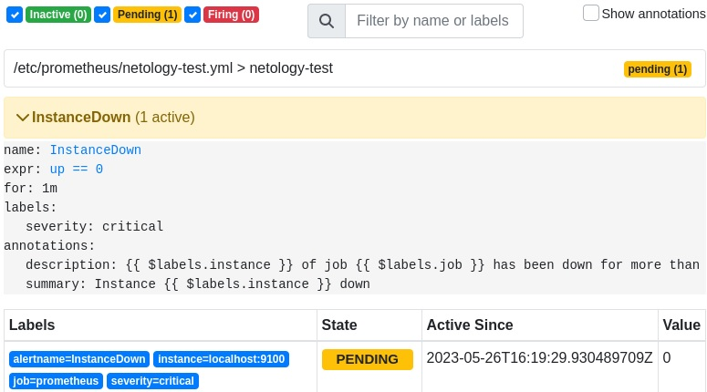
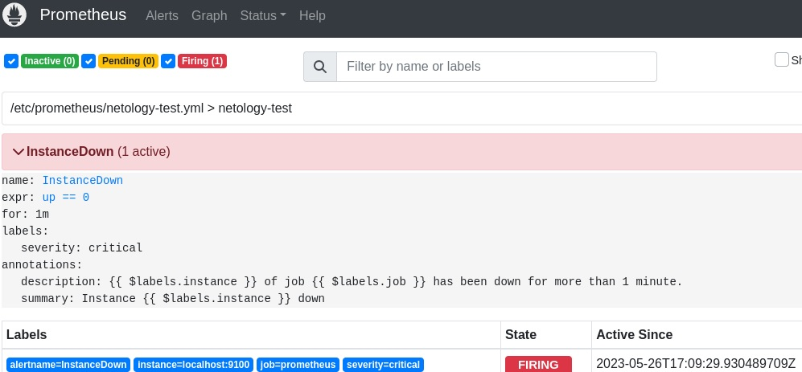
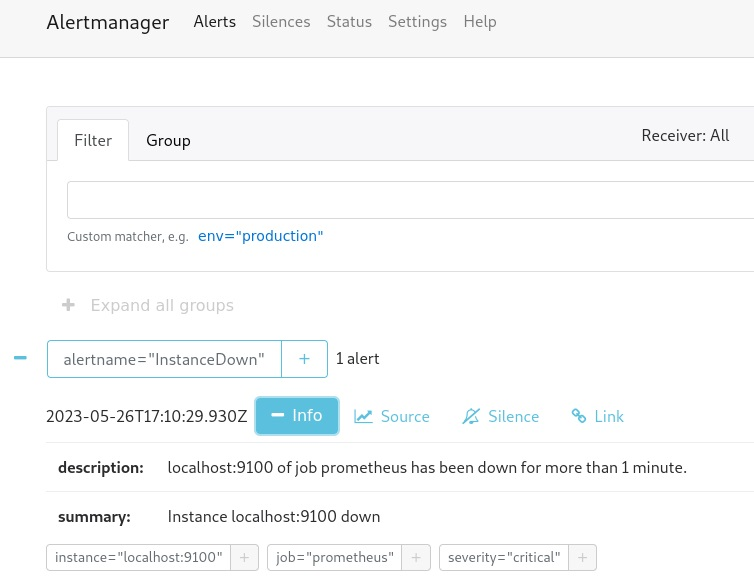
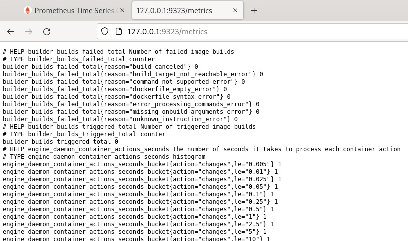
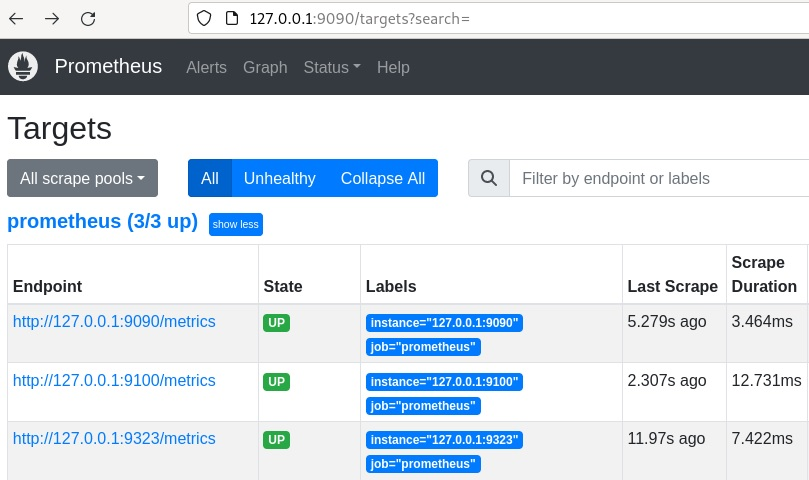
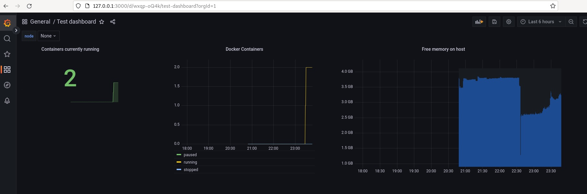

# Система мониторинга Prometheus. Часть 2
## Домашнее задание. Горбунов Владимир

## Цели задания
1. Научитьcя настраивать оповещения в Prometheus
2. Научиться устанавливать Alertmanager и интегрировать его с Prometheus
3. Научиться активировать экспортёр метрик в Docker и подключать его к Prometheus.
4. Научиться создавать дашборд Grafana

## Содержание
- [Задание 1. Правила оповещения Prometheus](#Задание-1)
>Создайте файл с правилом оповещения, как в лекции, и добавьте его в конфиг Prometheus.
- [Задание 2. Alertmanager](#Задание-2)  
>Установите Alertmanager и интегрируйте его с Prometheus.
- [Задание 3. Экспортер метрик Docker](#Задание-3)  
>Активируйте экспортёр метрик в Docker и подключите его к Prometheus.
- [Задание 4*. Дашборд Grafana](#Задание-4)  
>Создайте свой дашборд Grafana с различными метриками Docker и сервера, на котором он стоит.

## Задание 1
- Правила оповещения Prometheus.

Создано оповещение netology-test.yml:
```yml
groups: 
- name: netology-test 
  rules: 
  - alert: InstanceDown 
    expr: up == 0 
    for: 1m 
    labels:
      severity: critical 
    annotations: 
      description: '{{ $labels.instance }} of job {{ $labels.job }} has been down for more than 1 minute.' 
      summary: Instance {{ $labels.instance }} down 
```
Node exporter на хосте остановлен:


В прометеусе после этого появилось оповещение в статусе "pending"


## Задание 2
- Alertmanager.

Алерт менеджер запущен в качестве сервисного юнита:
>/etc/systemd/system/prometheus-alertmanager.service
```bash
[Unit]
Description=Alertmanager Service
After=network.target
[Service]
EnvironmentFile=-/etc/default/alertmanager
User=prometheus
Group=prometheus
Type=simple
ExecStart=/usr/local/bin/alertmanager --config.file=/etc/prometheus/alertmanager.yml --storage.path=/var/lib/prometheus/alertmanager $ARGS
ExecReload=/bin/kill -HUP $MAINPID
Restart=on-failure
[Install]
WantedBy=multi-user.target
```

Конфигурация алерт менеджера:
>/etc/prometheus/alertmanager.yml
```yaml
global:
route:
  group_by: ['alertname']
  group_wait: 30s
  group_interval: 10m
  repeat_interval: 60m
  receiver: 'email'
receivers:
- name: 'email'
  email_configs:
  - to: 'yourmailto@todomain.com'
    from: 'yourmailfrom@fromdomain.com'
    smarthost: 'mailserver:25'
    auth_username: 'user'
    auth_identity: 'user'
    auth_password: 'paS$w0rd'
```
Сработка оповещения в прометеусе, статус firing:



Статус алерта в алерт менеджере:



## Задание 3
- Экспортер метрик Docker.

Включение встроенного экспортера метрик в докере:
>/etc/docker/daemon.json
```
{
"metrics-addr" : "localhost:9323",
"experimental" : true
}
```

Экспортер доступен на локальном порту 9323:



И появился в списке таргетов прометеуса:



## Задание 4
- Дашборд Grafana.

